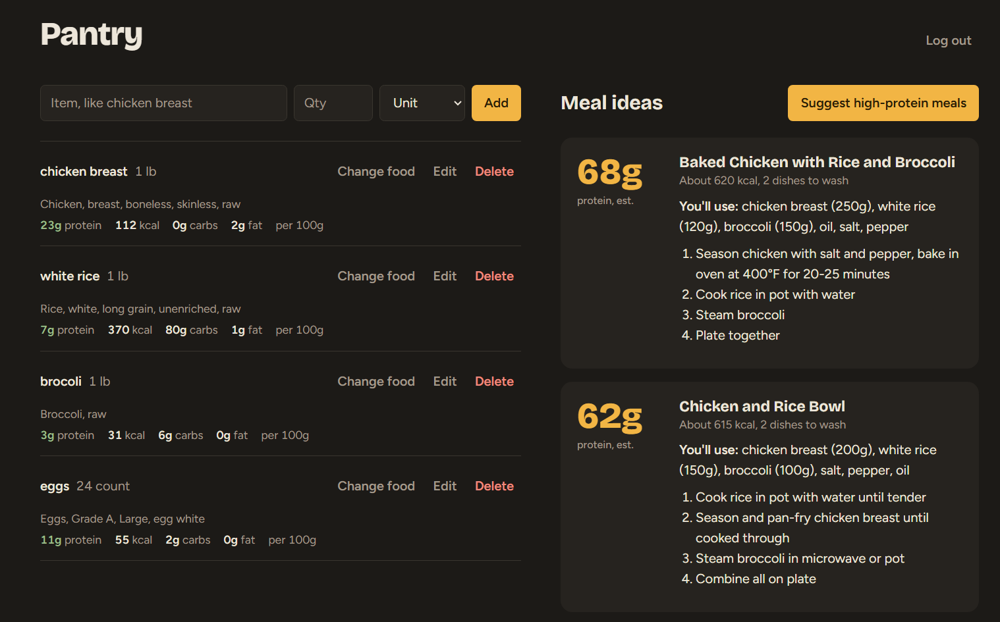
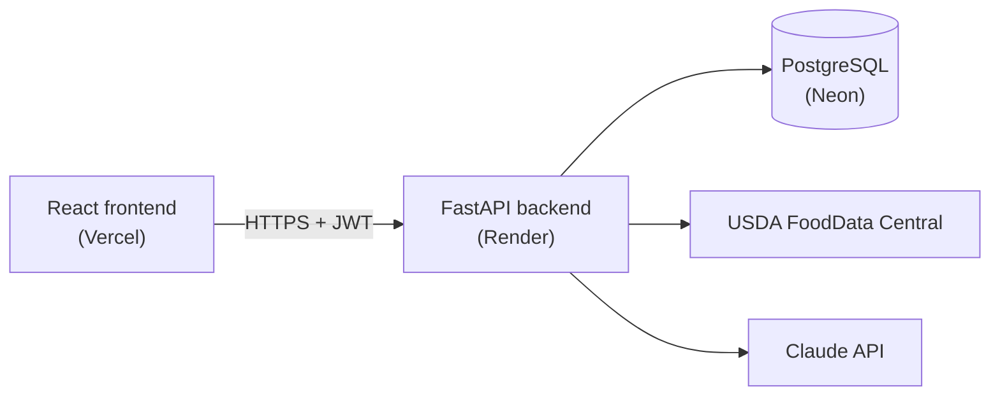

# Pantry Planner

[](https://github.com/tommytraver/pantry-planner/actions/workflows/ci.yml)

Turn what's in your kitchen into high-protein meals. Log your groceries, match them to USDA nutrition data, and get AI meal ideas ranked by protein and by how few dishes they leave you to wash.

**Live demo: [pantry-planner-rosy.vercel.app](https://pantry-planner-rosy.vercel.app)** (click "Try the demo", no account needed)

> Hosted on free tiers, so the first load after a quiet period can take up to a minute while the server wakes up. The app tells you when that's happening.



## Features

- **Pantry tracking** with accounts, so each person sees only their own items
- **Nutrition matching** against USDA FoodData Central, with a picker to choose the right food and a custom relevance ranking on top of USDA's search
- **AI meal suggestions** from Claude, validated against a strict schema and ranked in code by protein first, then fewest dishes
- **One-click demo** that creates a throwaway account with a stocked pantry

## Stack

| Layer | Tech |
|---|---|
| Frontend | React, Vite, plain CSS |
| Backend | Python, FastAPI, SQLModel (SQLAlchemy + Pydantic) |
| Database | PostgreSQL |
| Auth | JWT bearer tokens, Argon2 password hashing |
| External APIs | USDA FoodData Central, Anthropic Claude |
| Testing / CI | pytest, GitHub Actions (backend tests + frontend lint on every push) |
| Hosting | Vercel (frontend), Render (backend), Neon (Postgres) |

## Architecture



The browser only ever talks to the backend. All API keys live on the server, so nothing secret ships in the frontend bundle.

## Design decisions

- **The backend proxies every external API.** The USDA and Anthropic keys never reach the browser. The USDA key is also sent in a header rather than the URL, so it can't leak into request logs.
- **AI output is treated as untrusted input.** Claude is asked for JSON in a fixed shape; the response is parsed and validated with Pydantic, and anything malformed becomes a clean 502 instead of a crash. Ranking happens in Python, not in the prompt, so it's deterministic and testable.
- **Search results are re-ranked.** USDA's own ranking often put baby food and snack chips above the raw ingredient. The backend pulls a wider candidate set and scores it: whole-word matches, a bonus for matching every query word, a boost for raw foods and USDA's highest-quality dataset, and a penalty for processed foods.
- **Rate limiting in layers.** Each user gets 10 AI suggestions per hour, the whole app has a daily cap, and the provider account has a hard spend limit. Limits are stored in Postgres, so they survive restarts.
- **Per-user data isolation is enforced and tested.** Every pantry query is scoped to the logged-in user, and requests for another user's items return 404 rather than 403, so item IDs can't be probed. A test verifies one user can't read, edit, or delete another's data.
- **Validation happens in both layers.** The frontend blocks bad input for a better experience; the backend re-validates everything, because clients can be bypassed.

## Running locally

**Requirements:** Python 3.14, Node 24, PostgreSQL

### Backend

```bash
cd backend
python -m venv .venv
source .venv/bin/activate        # Windows (Git Bash): source .venv/Scripts/activate
pip install -r requirements.txt
cp .env.example .env             # then fill in the values
uvicorn main:app --reload
```

Create a local database first (e.g. `CREATE DATABASE pantry_planner;` in psql). Tables are created automatically on startup. API docs are at `http://localhost:8000/docs`.

### Frontend

```bash
cd frontend
npm install
cp .env.example .env
npm run dev
```

The app runs at `http://localhost:5173`.

### Tests

```bash
cd backend
pytest -v
```

Tests run against an in-memory SQLite database and fake the AI call, so they need no API keys, network access, or local Postgres.

## Known limitations

- Nutrition is shown per 100g rather than for the quantity you own
- AI protein and calorie numbers are estimates, labeled as such in the UI
- Search can't tell "with skin" from "without skin"
- No password reset, email verification, or login rate limiting yet
- Schema changes are applied by hand; a migration tool (Alembic) is the next step

Planned improvements are tracked in [Issues](https://github.com/tommytraver/pantry-planner/issues).
